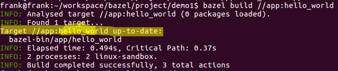
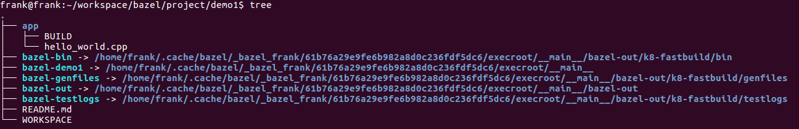
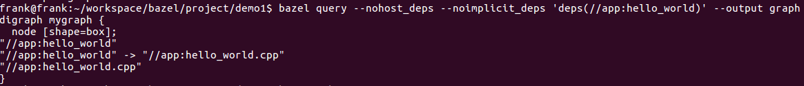

demo1 使用bazel编译一个源文件生成可执行程序简单示例

# demo1目录树

demo1
​    ├── app
​    │   ├── BUILD
​    │   └── hello_world.cpp
​    ├── README.md
​    └── WORKSPACE

# workspace

>A *workspace* is a directory on your filesystem that contains the source files for the software you want to build, as well as symbolic links to directories that contain the build outputs. Each workspace directory has a text file named `WORKSPACE` which may be empty, or may contain references to [external dependencies](https://docs.bazel.build/versions/master/external.html) required to build the outputs. See also the [Workspace Rules](https://docs.bazel.build/versions/master/be/workspace.html) section in the Build Encyclopedia.

workspace可以理解为一个project的根目录所在地，那么如果要指定一个目录为bazel的workspace，只需要在该目录下创建一个workspace文件即可。workspace可以为空，当然，当工程庞大复杂有外部依赖时，可以在workspace中指定外部依赖引用。

本例中，在demo1目录下创建了一个空的workspace文件，那么demo1目录将作为一个workspace。

这里使用一个类比的例子。一般写字楼里会入驻很多公司，workspace就好比一个公司，每个公司都有自己的大门，而这个大门就好比是workspace文件。我们只要看到公司的大门，就知道，哦，这是一个公司。同样，我们看到一个workspace文件就知道本目录是一个workspace空间。

# package

>The primary unit of code organization in a workspace is the *package*. A package is a collection of related files and a specification of the dependencies among them.
>
>A package is defined as a directory containing a file named `BUILD`, residing beneath the top-level directory in the workspace. A package includes all files in its directory, plus all subdirectories beneath it, except those which themselves contain a BUILD file.

package可以理解为workspace空间中的子模块。在workspace空间下创建一个目录，该目录下再创建一个BUILD文件，那么该目录就可以看作是一个package。该目录下的所有对象都属于该package，除了子目录下又有BUILD文件。

本例中，app就是一个package。

一个package就好比一个公司里不同部门的办公室，每个办公室都有自己的门，而这个门就好比是一个BUILD文件。

# target

>A package is a container. The elements of a package are called *targets*. Most targets are one of two principal kinds, *files* and *rules*. Additionally, there is another kind of target, [package groups](https://docs.bazel.build/versions/master/be/functions.html#package_group), but they are far less numerous.
>
>Files are further divided into two kinds. *Source files* are usually written by the efforts of people, and checked in to the repository.*Generated files*, sometimes called derived files, are not checked in, but are generated by the build tool from source files according to specific rules.
>
>The second kind of target is the *rule*. A rule specifies the relationship between a set of input and a set of output files, including the necessary steps to derive the outputs from the inputs. The outputs of a rule are always generated files. The inputs to a rule may be source files, but they may be generated files also; consequently, outputs of one rule may be the inputs to another, allowing long chains of rules to be constructed.
>
>

package中的target主要有两种:文件和规则。文件也分为两种:源文件和生成文件。规则定义怎样根据输入生成相应的输出。

#　label

>All targets belong to exactly one package. The name of a target is called its *label*, and a typical label in canonical form looks like this:
>
>```shell
>//app:hello_world
>```
>
>Each label has two parts, a package name (app) and a target name (hello_world). Every label uniquely identifies a target. Labels sometimes appear in other forms; when the colon is omitted, the target name is assumed to be the same as the last component of the package name, so these two labels are equivalent:
>
>

lable标签属于一个包，一个标签由两部分组成:包名+目标名并由“//”开头，即 //package-name:target-name。这类似与一个绝对路径，保证搜索不会出错。本例中报名就是app，目标名就是hello_world。

# rules

>A rule specifies the relationship between inputs and outputs, and the steps to build the outputs. Rules can be of one of many different kinds or *classes*, which produce compiled executables and libraries, test executables and other supported outputs as described in the [Build Encyclopedia](https://docs.bazel.build/versions/master/be/overview.html).
>
>Every rule has a name, specified by the `name` attribute, of type string. The name must be a syntactically valid target name, as specified [above](https://docs.bazel.build/versions/master/build-ref.html#name). In some cases, the name is somewhat arbitrary, and more interesting are the names of the files generated by the rule; this is true of genrules. In other cases, the name is significant: for `*_binary` and `*_test` rules, for example, the rule name determines the name of the executable produced by the build.
>
>Every rule has a set of *attributes*; the applicable attributes for a given rule, and the significance and semantics of each attribute are a function of the rule's class; see the [Build Encyclopedia](https://docs.bazel.build/versions/master/be/overview.html) for the full list of supported rules and their corresponding attributes. Each attribute has a name and a type. Some of the common types an attribute can have are integer, label, list of labels, string, list of strings, output label, list of output labels. Not all attributes need to be specified in every rule. Attributes thus form a dictionary from keys (names) to optional, typed values.
>
>

规则指定了生成什么目标，如，可执行程序，库文件等。每一条规则都有名字，而名字通过name属性定义。每条规则包含很多属性，每个属性可看成是key-value，value值有自己支持类型，如 integer, label, list of labels, string, list of strings, output label, list of output labels。

我们前面提到，一个package包含一个BUILD文件，而BUILD文件中要写什么内容呢?就是rules。即需要我们来写构建规则，使bazel构建出我们想要的东东。

构建规则的内容涉及非常多的细节，本系列采用示例的形式，由浅到深，逐渐的带出构建规则。

本例中，BUILD文件内容如下:

```bash
cc_binary(
    name = "hello_world",
    srcs = ["hello_world.cpp"],
)

```

cc_binary即声明了一个构建规则，用于编译生成一个可执行文件。可执行文件名(目标名)由name属性指定，name属性的值的类型可以看出是string类型。srcs属性指定了源文件，srcs属性的值的类型可以看出是list of strings。

*_binary 规则：指定生成相应语言的可执行程序。cc_binary表示c++可执行程序，jave_binary表示java可执行程序。

*_library 规则：指定生成相应语言的库。

*_test 规则：是一个特殊的bianry规则，通常用于自动化测试。


当我们准备好了workspace，package，编写好了BUILD文件，接下来就可以用bazel来生成我们想要的可执行程序。



先进入到workspace空间，即demo1目录；然后指定编译那个target，即执行bazel build //app:hello_world；其中app是本空间中包路径，hello_world是指定package中的目标路径。最终生成可执行程序hello_world。同时所有的生成的文件都在workspace所在的目录下。



生成的hello_world文件放在bazel-bin下，执行bazel-bin/app/hello_world即可运行该程序。

# dependency graph

当一个项目庞大后，我想找到各部分之间的依赖关系，我们可以通过依赖图来查看。



通过query命令来生成依赖图。从中可以看出，//app:hello_world" 依赖 "//app:hello_world.cpp"

