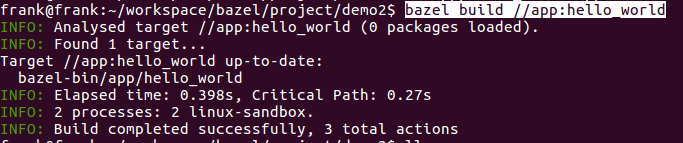
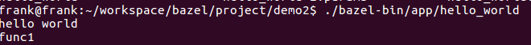

demo2 使用bazel编译多目标示例，一个bianry，一个library。

# demo2目录树

── demo2
​    ├── app
​    │   ├── BUILD
​    │   ├── func.cpp
​    │   ├── func.hpp
​    │   └── hello_world.cpp
​    ├── README.md
​    └── WORKSPACE

本例和demo1类似，差异仅在于BUILD文件。

```bash
cc_library(
    name = "hello_func",
    srcs = ["func.cpp"],
    hdrs = ["func.hpp"],
)

cc_binary(
    name = "hello_world",
    srcs = ["hello_world.cpp"],
    deps = [
        ":hello_func",
    ],
)

```

name和srcs不再赘述(见demo1)，hdrs就是指定头文件；deps就是指定依赖；hello_world依赖hello_func，而hello_func即是一个lib　target。

接下来我们进行构建，在demo2目录下执行　bazel build //app:hello_world



然后执行hello_world，看看是不是我们期望的结果



显然，构建成功。

这里提两个问题:

Q1：如果在app下再建一个目录lib，将func.*放在lib目录中，BUILD构建是否需要修改?

见demo2_1

Q2：hello_func并不是我们常见的lib\*.so的动态库的形式，要想生成lib\*.so需要怎么做呢?

见demo2_2