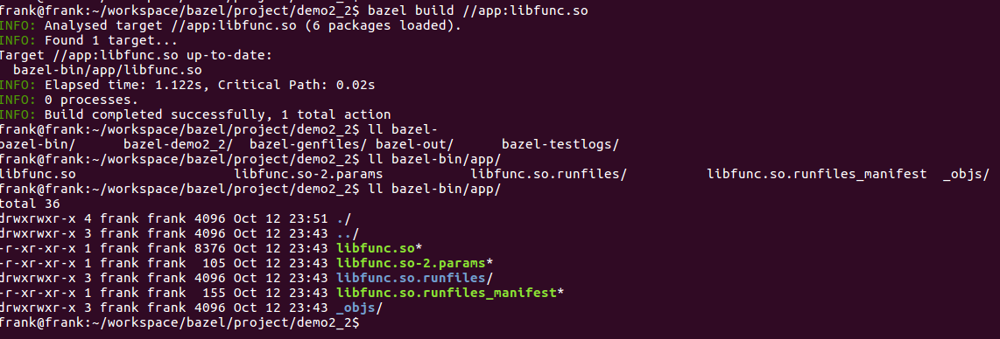

demo2_2　 使用baze编译动态库

# demo2_2目录树

├── app
│   ├── BUILD
│   ├── func.cpp
│   └── func.hpp
├── README.md
└── WORKSPACE

BUILD:

```bash
cc_binary(
    name = "libfunc.so",
    srcs = ["func.hpp","func.cpp"],
    linkshared = True,
)	
```

## cc_binary.srcs

1. 支持的文件类型
   * c/c++源文件:.c,.cc,.cpp,.cxx,.c++,.C
   * c/c++头文件:.h,.hh,.hpp,.hxx,.inc
   * .S
   * .a,.pic.a
   * .lo,.pic.lo
   * .so,.so.version
   * .o, .pic.o

## cc_binary.linkshared

作用：编译生成动态库。需要使能linkshared属性，默认该属性是关闭状态。如果使能该属性后，binary的name属性必须要要命名成lib*.so。使能这个属性相当于gcc -shared。

