# getopt()

```c
#include <unistd.h>

int getopt(int argc, char * const argv[],
                  const char *optstring);

extern char *optarg;
extern int optind, opterr, optopt;
```
getopt()函数的作用：解析命令行参数。

当命令行中的元素以"-"开头，那么该元素(argv[i])就是参数选项，其后的字符串就是参数。参数选项列表通过***optstring***指定。

测试代码如下：

```c
#include <stdio.h>
#include <stdlib.h>
#include <unistd.h>

int main(int argc, char** argv)
{
    int opt;
    printf("optind:%d\n", optind);

    opt = getopt(argc, argv, "ha:b::");

    printf("opt:%d\n", opt);
    printf("optarg:%s\n", optarg);
    printf("optind:%d\n", optind);

    return 0;
}
```


> The  variable  ***optind***  is the index of the next element to be processed in argv.  The system initializes this value to 1.  The caller can reset it to 1 to restart scanning of the same argv, or when scanning a new argument vector.

***optind*** 的值为 ***argv***中下一个待处理参数的索引值。***optind***的初始值为1。调用者可以将optind设置为1，来重新扫描***argv***。

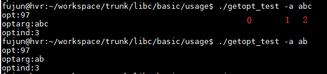
<center>图1</center>

从上图可以看出，optind的值为3，即下一个参数的索引值。

>***optstringi*** is a string containing the legitimate option characters.  If such a character is followed by a colon, the option requires an argument, so getopt() places a pointer to the following text in the same argv-element, or the text of the following argv-element, in optarg.  Two colons mean an option takes an optional arg; if there is text in the current argv-element (i.e., in the  same  word  as  the  option  name  itself,  for  example, "-oarg"),  then  it  is  returned in optarg, otherwise optarg is set to zero.  This is a GNU extension. 

如果***optstring***中的字符后跟了一个冒号，那么该字符表示参数选项，并且必需带上参数（**如果不带参数，会有打印提示**）；同时***optarg***指向该参数，如图1所示，***optarg***指向 参数选项(-a)的参数(abc)。

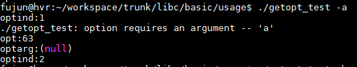

不带参数，会有打印提示"./getopt_test: option requires an argument -- 'a' "

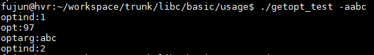

参数选项和参数之间没有空格分隔，也能正常解析。**建议，参数选项和参数之间用空格分隔**


如果***optstring***中的字符后跟了两个冒号，那个该字符表示可选参数选项，若带上参数，那么***optarg***指向该参数；若没有带上参数，那么***optarg***为NULL；

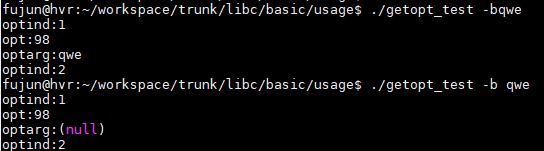

两冒号的参数选项，选项和参数之间必须连在一起，否则，***optarg***获取不到参数值。上图中，-b参数选项是两冒号的，当-b 与参数"qwe"之间有空格时，***optarg***为NULL。

如果***optstring***中的字符后没有跟冒号，那么参数选项不需要带参数。

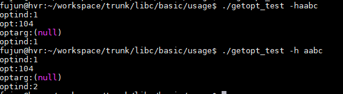

上图中，-h 是不带参数选项，所以***optarg***指向NULL。

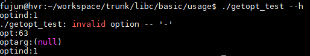

从上图可知，getopt()是不支持long option。如需要支持long option，则要使用getopt_long()函数。


# getopt_long()

```c
#include <getopt.h>

int getopt_long(int argc, char * const argv[],
           const char *optstring,
           const struct option *longopts, int *longindex);
```

>The getopt_long() function works like getopt() except that it also accepts long options, started with two dashes.  (If the program accepts only long options, then optstring should be specified as an empty string (""), not NULL.)  Long option names may be abbreviated if the abbreviation is unique or is an exact match for some defined option.  A long option may take a parameter, of the form --arg=param or --arg param.

getopt_long()的参数选项 是使用 two dashed("--")来指定。如果程序支持 长参数选项，需要将***optstring***设置为空串("")。长选项参数的目的是为了避免参数产生歧义，只要不产生歧义，也可以只用缩写。

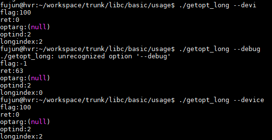

{"device", 2, &flag, 'd'}，由上图可知，--devi 由于不会产生歧义，就作为device处理；

>$$longopts$$ is a pointer to the first element of an array of **struct option** declared in <getopt.h> as
>
>struct option {
>               const char *name;
>               int         has_arg;
>               int        *flag;
>               int         val;
> };
>
>The meanings of the different fields are:
>
> ***name***   is the name of the long option.
>
>***has_arg***
>              is: no_argument (or 0) if the option does not take an argument; required_argument (or 1) if the option requires an argument; or optional_argument (or 2) if the option takes an optional argument.
>
>***flag***   specifies how results are returned for a long option.  If ***flag*** is NULL, then getopt_long() returns ***val***.  (For example, the calling program may  set  ***val***  to  the  equivalent  short  option  character.)   Otherwise, getopt_long() returns 0, and flag points to a variable which is set to val if the option is found, but left unchanged if the option is not found.
>
>***val***    is the value to return, or to load into the variable pointed to by flag.
>
>**The last element of the array has to be filled with zeros**.k
>
>If ***longindex*** is not NULL, it points to a variable which is set to the index of the long option relative to ***longopts***.

```c
int main(int argc, char** argv)
{
    int c;
    int longindex = 0;
    int time = -1;

    struct option long_option[] =
    {
        {"help", 0, NULL, 'h'},
        {"time", 1, &time, 't'},
        {"device", 2, NULL, 'd'},
        {NULL, 0, NULL, 0},
    };

    c = getopt_long(argc, argv, "ht:d:", long_option, &longindex);

    printf("c:%d\n", c);
    printf("optarg:%s\n", optarg);
    printf("optind:%d\n", optind);
    printf("longindex:%d\n", longindex);
    printf("time=%d\n", time);

    return 0;
}
```


如果flag为NULL，getopt_long()的返回值为val(即对应的 短参数选项字符的值)；如果指定了flag，getopt_long的返回值为0，若有指定相应的option，则flag的值为val。

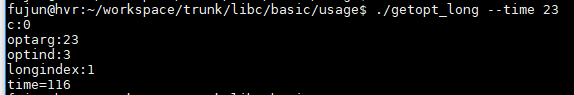

指定了flag，getopt_long的返回值c等于0；flag变量time的值为字符't'的值。longindex指向longopts数组的第一个元素。

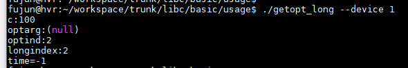

flag为NULL，getopt_long的返回值c等于字符'd'的值。

## --arg=param和--arg param的区别

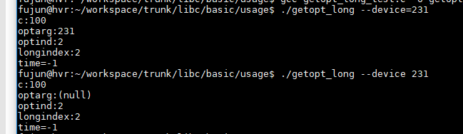

建议 使用 --arg=param 格式。


```c
int main(int argc, char** argv)
{
    int ret = -1;
    int longindex = 0;

    struct option long_option[] =
	{
		{"help", 0, NULL, 'h'},
		{"time", 1, NULL, 't'},
		{"device", 2, NULL, 'd'},
		{"debug", 1, NULL, 'd'},
		{NULL, 0, NULL, 0},
	};

    while((ret = getopt_long(argc, argv, "ht:d:", long_option, &longindex)) >= 0)
    {
        switch(ret)
        {
        case 'h':
            printf("help\n");
            break;
        case 't':
            printf("optind:%d\n", optind);
            printf("longindex:%d\n", longindex);
            printf("time:%s\n", optarg);
            break;
        case 'd':
            printf("optind:%d\n", optind);
            printf("longindex:%d\n", longindex);
            if (0 == strcmp("device", long_option[longindex].name))
            {
                printf("device:%s\n", optarg); 
            }
            else if (0 == strcmp("debug", long_option[longindex].name))
            {
                printf("debug:%s\n", optarg); 
            }
            break;
        default:
            printf("?? getopt returned character code 0x%x ??\n", ret);
            break;
        }
    }

    return 0;
}
```


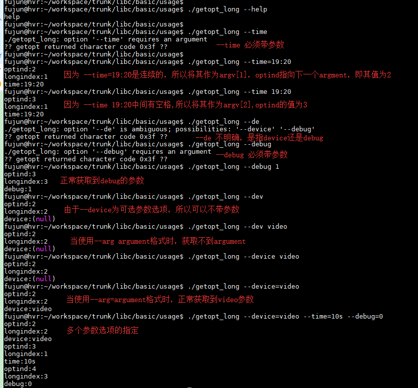


